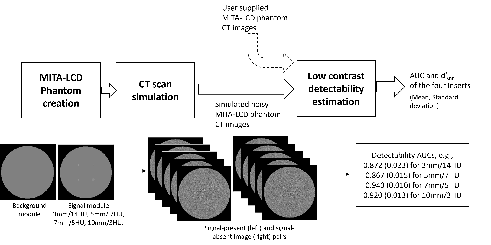

Low Contrast Detectability for CT Toolbox
=========================================

|zenodo| |zenodo1| |docs|

**Low Contrast Detectability for CT (LCD-CT) Toolbox** provides a common interface to evaluate the low contrast detectability (LCD) performance of advanced nonlinear CT image reconstruction and denoising algorithms. The toolbox uses model observers (MO) to evaluate the LCD of targets with known locations in test images obtained with the standard uniform-background `MITA-LCD phantom <https://www.phantomlab.com/catphan-mita>`_ or a nonuniform-background Liver-LCD phantom . The model observer detection accuracy is measured by the area under the receiver operating characteristic curve (AUC) and the detectability signal-to-noise ratio (d’_{snr}).  The LCD-CT toolbox can be used by CT developers to perform initial evaluation on image quality improvement or dose reduction potential of their reconstruction and denoising algorithms.

- **Regulatory Science Tool:** Check the FDA website for a description of the LCD-CT toolbox in the `Regulatory Science Tool Catalog <https://cdrh-rst.fda.gov/lcd-ct-low-contrast-detectability-lcd-test-assessing-advanced-nonlinear-ct-image-reconstruction-and>`_

.. |zenodo| image:: https://zenodo.org/badge/DOI/10.5281/zenodo.7996580.svg
    :alt: Zenodo Data Access
    :scale: 100%
    :target: https://doi.org/10.5281/zenodo.7996580

.. |zenodo1| image:: https://zenodo.org/badge/DOI/10.5281/zenodo.22149090.svg
    :alt: Zenodo Data Access
    :scale: 100%
    :target: https://doi.org/10.5281/zenodo.22149090

.. |docs| image:: https://readthedocs.org/projects/docs/badge/?version=latest
    :alt: Documentation Status
    :scale: 100%
    :target: https://lcd-ct.readthedocs.io/en/latest/?badge=latest

Features
--------
1. Digital phantom and CT simulaiton:  

- Creating digital replica of the background and signal modules of the `MITA-LCD phantom <https://www.phantomlab.com/catphan-mita>`_ and a digital Liver-LCD phantom that contains low-contrast disks in a non-uniform,  anatomical background.  
- Simuating sinogram and generate fan-beam CT scans of the digital phantoms based on the publicly available `Michigan Image Reconstruction Tolbox (MIRT) <http://web.eecs.umich.edu/~fessler/irt/fessler.tgz>`_. Note that the MIRT package is compatible with Linux and mac systems but may not be fully compatible with Windows (see `MIRT Readme <https://web.eecs.umich.edu/~fessler/irt/irt/readme>`_ ).  
 
   *(This feature runs best in MATLAB.)*

2. LCD test: 

- Estimating low contrast detectability performance from the MITA-LCD or Liver-LCD phantom CT images using channelized Hoteling model observer with Laguerre-Gauss (LG) channels and two options of Difference-of-Gaussian (DOG) channels and Gabor channels.

   *(This feature runs in both MATLAB and python.)*

3. Dose reduction estimation: 

- - Estimating the dose reduction percentages of an evaluated nonlinear reconstruction method relative to a reference method (e.g., filtered back projection method) using the AUC results of the evaluated and the reference reconstruction methods across multiple dose levels obtained from a LCD test.  

   *(This feature runs only in python.)*

Start Here
----------

.. _version requirements:

**Requirements**

- **Python (>= 3.8)** with packages listed in `pyproject.toml` (numpy, scipy, scikit-image, etc.)
- Matlab (**version > R2016a**) 
.. *or* Octave (**version > 4.4**)
.. - If the above Matlab or Octave requirements are not met, then `conda <https://conda.io/projects/conda/en/latest/user-guide/install/index.html>`_ is required to install Octave using the `installation`_ instructions.

.. If required versions of Matlab or Octave are not available on your system (see how to get `matlab version <https://www.mathworks.com/help/matlab/ref/version.html>`_ or `octave version <https://docs.octave.org/v4.4.0/System-Information.html#XREFversion>`_) then see `installation`_ for how to setup an Octave environment to run LCD-CT.

.. _installation:

**Installation**

1. Git clone the LCD-CT Toolbox repository:

.. code-block:: shell

        git clone https://github.com/DIDSR/LCD_CT
        cd LCD_CT

2. **Python**:

 - Create a `conda <https://conda.io/projects/conda/en/latest/user-guide/install/index.html>`_  environment and install the package:

   .. .. code-block:: shell

           conda env create --file environment.yml
           conda activate LCD_CT
           pip install -e .
   
   .. code-block:: shell      

           conda create -n LCD_CT python=3.8 pip -y
           conda activate LCD_CT
           conda install -c conda-forge -c defaults octave cxx-compiler pandas tomli numpy oct2py pytest simpleitk scikit-image scikit-learn scipy matplotlib sphinx-tabs pandoc ipykernel git -y
           pip install "git+https://github.com/DIDSR/pediatricIQphantoms" sphinxcontrib-svg2pdfconverter nbsphinx
           pip install -e .

   *Expected run time: 2-5 min*

 - Test the python installation

   Run the following tests in the conda LCD-CT virtual environment:

   .. code-block:: shell
          
           pytest tests/test_lcd.py
           python demo_analyze_dose_reduction.py

3. **MATLAB**:
  
   MATLAB version information is available from `MATLAB <https://www.mathworks.com/support/requirements/previous-releases.html>`_. See how to get `matlab version <https://www.mathworks.com/help/matlab/ref/version.html>`_ on your system.
   
    From the bash command line 
    
    .. code-block:: matlab
      
       matlab -batch "test" 
  
    Or, from the Matlab prompt

    .. code-block:: matlab
       
           >> test

    *Expected run time: 2 min 30 s*

4. **(Optional) GNU OCTAVE**:

   If Matlab is not available, `GNU Octave <https://octave.org/>`_ (**version > 4.4**) can be installed using source `install.sh` to prepare a `conda <https://conda.io/projects/conda/en/latest/user-guide/install/index.html>`_ environment.  

   Please note that the MATLAB part of this software has been fully developed and tested using MATLAB. GNU Octave may also be used to run the software; however, Octave compatibility has not been fully tested or validated. Although Octave is largely compatible with MATLAB, differences exist in the availability and behavior of certain functions and toolboxes. Users who choose to run this software with GNU Octave may need to install additional Octave packages and modify or replace MATLAB-specific functions with their Octave-compatible equivalents. Users are responsible for making any necessary adaptations for their specific Octave environment and for verifying that the resulting outputs are consistent with their expected use.
  
 - Create a Conda Octave environment and install the package: 

   .. code-block:: shell

           source install.sh

   *Expected run time: 10-30 min*

 - Test Octave

   In the Conda Octave virtual environment, run:

   .. code-block:: octave
      
       octave test.m 
 
   .. Or, through the interactive prompt
   .. .. code-block:: octave

   ..         >> octave --gui --line-editing
   ..         >> test

   *Expected run time: 2 min. 

  
   **Note:** The Liver-LCD Phantom Creation code (makeCT_LiverLCD.m in folder "LCD Phantom creation") is not compatible with Octave, because it calls mex-functions in MIRT that are not compiled for Octave (check `MIRT webpage <https://web.eecs.umich.edu/~fessler/code/>`_ ). For this reason, makeCT_LiverLCD is excluded from being tested in Octave. Use MATLAB to run makeCT_LiverLCD.m.

.. Figures may appear black in Octave due to a graphic library conflict between octave and your system display server. check ... for possible solutions* 
   

Tool Reference
--------------

- RST Reference Number: RST24MD08.01
- Date of Publication: 09/24/2023
- Recommended Citation: U.S. Food and Drug Administration. (2023). LCD-CT: Low-contrast Detectability (LCD) Test for Assessing Advanced Nonlinear CT Image Reconstruction and Denoising Methods (RST24MD08.01). https://cdrh-rst.fda.gov/lcd-ct-low-contrast-detectability-lcd-test-assessing-advanced-nonlinear-ct-image-reconstruction-and

Disclaimer
==========

**About the Catalog of Regulatory Science Tools**

The enclosed tool is part of the `Catalog of Regulatory Science Tools <https://cdrh-rst.fda.gov>`_, which provides a peer-reviewed resource for stakeholders to use where standards and qualified Medical Device Development Tools (MDDTs) do not yet exist. These tools do not replace FDA-recognized standards or MDDTs. This catalog collates a variety of regulatory science tools that the FDA's Center for Devices and Radiological Health's (CDRH) Office of Science and Engineering Labs (OSEL) developed. These tools use the most innovative science to support medical device development and patient access to safe and effective medical devices. If you are considering using a tool from this catalog in your marketing submissions, note that these tools have not been qualified as `Medical Device Development Tools <https://www.fda.gov/medical-devices/medical-device-development-tools-mddt>`_ and the FDA has not evaluated the suitability of these tools within any specific context of use. You may `request feedback or meetings for medical device submissions <https://www.fda.gov/regulatory-information/search-fda-guidance-documents/requests-feedback-and-meetings-medical-device-submissions-q-submission-program>`_ as part of the Q-Submission Program.

For more information about the Catalog of Regulatory Science Tools, email RST_CDRH@fda.hhs.gov.
