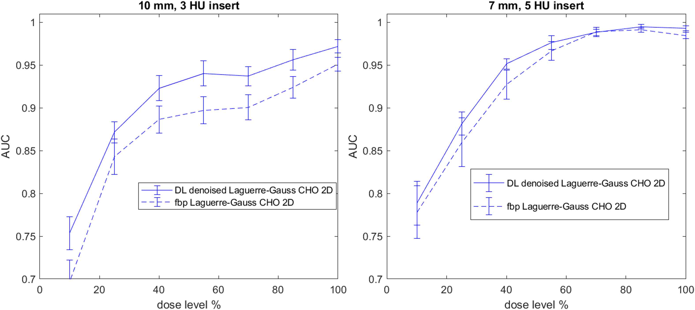

Low Contrast Detectability for CT Toolbox
=========================================

|zenodo| |docs|

**Low Contrast Detectability for CT (LCD-CT) Toolbox** provides a common interface to evaluate the low contrast detectability (LCD) performance of advanced nonlinear CT image reconstruction and denoising algorithms. The toolbox uses model observers (MO) to evaluate the LCD of targets with known locations in test images obtained with the `MITA-LCD phantom <https://www.phantomlab.com/catphan-mita>`_. The model oberver detection accuracy is measured by the area under the receiver operating characteristic curve (AUC) and the detectability signal-to-noise ratio (d’_{snr}).  The LCD-CT toolbox can be used by CT developers to perform initial evaluation on image quality impprovement or dose reduction potential of their reconstruction and denoising algorithms.

.. image:: diagram.png
        :width: 800
        :align: center

- **Regulatory Science Tool:** Check the FDA website for a description of the LCD-CT toolbox in the `Regulatory Science Tool Catalog <https://www.fda.gov/medical-devices/science-and-research-medical-devices/lcd-ct-low-contrast-detectability-lcd-test-assessing-advanced-nonlinear-ct-image-reconstruction-and>`_

.. |zenodo| image:: https://zenodo.org/badge/DOI/10.5281/zenodo.7996580.svg
    :alt: Zenodo Data Access
    :scale: 100%
    :target: https://doi.org/10.5281/zenodo.7996580

.. |docs| image:: https://readthedocs.org/projects/docs/badge/?version=latest
    :alt: Documentation Status
    :scale: 100%
    :target: https://lcd-ct.readthedocs.io/en/latest/?badge=latest

Features
--------

- Creating digital replica of the background and signal modules of the `MITA-LCD phantom <https://www.phantomlab.com/catphan-mita>`_.  
- Simuating sinogram and generate fan-beam CT scans of the digital phantoms based on the publicly available `Michigan Image Reconstruction Tolbox (MIRT) <https://github.com/JeffFessler/mirt>`_.
- Estimating low contrast detectability performance from the MITA-LCD phantom CT images using channelized Hoteling model observer with Laguerre-Gauss (LG) channels and two options of Difference-of-Gaussian (DOG) channels and Gabor channels.

Start Here
----------

.. _version requirements:

**Requirements**

- Matlab (**version > R2016a**) *or* Octave (**version > 4.4**)
- If the above Matlab or Octave requirements are not met, then `conda <https://conda.io/projects/conda/en/latest/user-guide/install/index.html>`_ is required to install Octave using the `installation`_ instructions.

If required versions of Matlab or Octave are not available on your system (see how to get `matlab version <https://www.mathworks.com/help/matlab/ref/version.html>`_ or `octave version <https://docs.octave.org/v4.4.0/System-Information.html#XREFversion>`_) then see `installation`_ for how to setup an Octave environment to run LCD-CT.

.. _installation:

**Installation**

1. Git clone the LCD-CT Toolbox repository:

.. code-block:: shell

    git clone https://github.com/DIDSR/LCD_CT

2. *If neither Matlab or Octave are installed or do not meet the `version requirments`_, you can source `install.sh` to prepare a `conda <https://conda.io/projects/conda/en/latest/user-guide/install/index.html>`_ environment. Note: this can take about 10 minutes to complete.

.. code-block:: shell

        source install.sh

3. Test the installation

- From the bash command line `octave test.m` or `matlab -batch test.m`

- From the Matlab or Octave interactive prompt

.. code-block:: octave

        >> test

How to Use the LCD-CT Toolkit
-----------------------------

After installing review the `LCD-CT Toolkit Documentation <https://lcd-ct.readthedocs.io/en/latest/>`_ and the demos to learn how to use the tool to assess low contrast detectability:

- **demo_01_singlerecon_LCD.m**
- **demo_02_tworecon_LCD.m**
- **demo_03_tworecon_dosecurve_LCD.m**

Additional demos of tool usage can be found in additional_demos.

The following AUC-vs-dose curves were generated by demo_03_tworecon_dosecurve_LCD.m using the large data set available at `Zenodo <https://zenodo.org/record/7996580>`_ and the LG channelized Hoteling model observer.

Michigan Image Reconstruction Toolkit
-------------------------------------

The LCD Phantom Creation code uses functions from `Michigan Image Reconstruction Toolkit (MIRT) <https://github.com/JeffFessler/mirt>`_. It should be automatically downloaded and installed when 'demo_test_phantomcreation.m' is run. If the automatic download does not work (this can happen when the matlab/octave upzip() function does not successfully extract all the files), this can be done manually:

1) download MIRT from https://github.com/JeffFessler/mirt; 
2) Upzip MIRT to a local directory; 
3) In Matlab, Run the file "setup.m" in the MIRT local directory to add all the MIRT subdirectories to the MATLAB workspace;  

To test whether the setup is successful, run **demo_test_phantomcreation.m**.

Contribute
----------

`Issue Tracker <https://github.com/DIDSR/LCD_CT/issues>`_ | `Source Code <https://github.com/DIDSR/LCD_CT>`_ | `Contributing Guide <https://lcd-ct.readthedocs.io/en/latest/contributing.html>`_

- **How to cite** 
   (*for paper*) Vaishnav, J.Y., Jung, W.C., Popescu, L.M., Zeng, R. and Myers, K.J. (2014), Objective assessment of image quality and dose reduction in CT iterative reconstruction. Med. Phys., 41: 071904. https://doi.org/10.1118/1.4881148

   (*for tool*) LCD-CT: Low-contrast detectability (LCD) test for assessing advanced nonlinear CT image reconstruction and denoising methods. https://www.fda.gov/medical-devices/science-and-research-medical-devices/lcd-ct-low-contrast-detectability-lcd-test-assessing-advanced-nonlinear-ct-image-reconstruction-and

   (*for data*)  Nelson, B., Zeng, R., CT Simulations of MITA Low Contrast Detectability Phantom for Model Observer Assessments. Published online June 1st, 2023. doi:10.5281/zenodo.7996580 

Support
-------

If you are having issues, please let us know.

*Toolbox developers: Brandon Nelson (brandon.nelson@fda.hhs.gov), PhD, Rongping Zeng, PhD (rongping.zeng@fda.hhs.gov)*

Disclaimer
----------

This software and documentation (the "Software") were developed at the Food and Drug Administration (FDA) by employees of the Federal Government in the course of their official duties. Pursuant to Title 17, Section 105 of the United States Code, this work is not subject to copyright protection and is in the public domain. Permission is hereby granted, free of charge, to any person obtaining a copy of the Software, to deal in the Software without restriction, including without limitation the rights to use, copy, modify, merge, publish, distribute, sublicense, or sell copies of the Software or derivatives, and to permit persons to whom the Software is furnished to do so. FDA assumes no responsibility whatsoever for use by other parties of the Software, its source code, documentation or compiled executables, and makes no guarantees, expressed or implied, about its quality, reliability, or any other characteristic. Further, use of this code in no way implies endorsement by the FDA or confers any advantage in regulatory decisions. Although this software can be redistributed and/or modified freely, we ask that any derivative works bear some notice that they are derived from it, and any modified versions bear some notice that they have been modified.

License
-------

The project is licensed under `Creative Commons Zero v1.0 Universal LICENSE`_.

Additional Resources
--------------------

- `DIDSR/IQModelo <https://github.com/DIDSR/IQmodelo>`_: Statistical Software for Task-Based Image Quality Assessment with Model (or Human) Observers
- `DIDSR/VICTRE_MO <https://github.com/DIDSR/VICTRE_MO>`_
- `Example of CT image noise insertion code <https://github.com/prabhatkc/ct-recon/tree/main/error_analysis/cho_lcd#readme>`_

