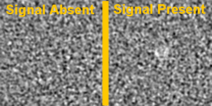

Low Contrast Detectability for CT Toolbox
=========================================

Low Contrast Detectability for CT Toolbox provides a common and simple interface to quickly evaluate the low contrast detectability performance of CT image reconstruction and denoising products with several builtin model observers. By providing examples of signal present and signal absent images like shown below, low contrast detectability performance can be calculated in just a few lines.

Look how easy it is to use:

    >> [sa_train, sa_test, sp_train, sp_test] = train_test_split(sa_imgs, sp_imgs);

    >> observer = DOG_CHO_2D();

    >> dog_res = observer.perform_study(sa_train, sp_train, sa_test, sp_test);

    >> fprintf('DOG CHO auc: %f\n', dog_res.auc)

    DOG CHO auc: 0.800000

Several model observers are builtin to the toolbox as well as examples on how to add others. The narrative demos provided can be adapted to your dataset to evaluate performance trends across dose levels, lesion size and contrast, as well as model observer choice:

.. image:: fbp_lcd_v_dose.png

Features
--------

- Creating digital replica of the background and signal modules of the MITA-LCD phantom.  
- Simuating sinogram and generate fan-beam CT scans of the digital phantoms based on the publicly available Michigan Image Reconstruction Tolbox (MIRT).
- Estimating low contrast detectability performance from the MITA-LCD phantom CT images using model observers.

.. _installation:

Installation
------------

Install Low Contrast Detectability for CT Toolbox by running:

    git clone https://github.com/DIDSR/LCD_CT

Then open the LCD_CT directory in Matlab and start working through the demos.

LCD_RST is compatible with Octave, however some functions such as `medfilt2` are not loaded by default, follow the command line instructions, e.g.: `pkg load image` to have `medfilt2` available, this only needs to be done once for a given Octave session.

Getting Started
---------------

After installing review the LCD RST Documentation https://lcd-ct.readthedocs.io/en/latest/ and the demos to learn how to use the tool to assess low contrast detectability and to learn more about selecting and optimizing model observers for your task.

Contribute
----------

- Issue Tracker: https://github.com/DIDSR/LCD_CT/issues
- Source Code: https://github.com/DIDSR/LCD_CT

This project uses sphinx <https://www.sphinx-doc.org/en/master/tutorial/narrative-documentation.html>, and specific details for the Matlab Domain: <https://github.com/sphinx-contrib/matlabdomain>

More resources on documentation: https://www.writethedocs.org/guide/

Support
-------

If you are having issues, please let us know.
brandon.nelson@fda.hhs.gov

License
-------

The project is licensed under the BSD license.

Alternatives
------------

- Duke CVIT Observer Models: https://cvit.duke.edu/resource/observer_model/

  - Inputs: simulated image data from Duke's CVIT Pipeline
  - Outputs: detectability indices for different signal-known-exactly model observers:
     1. Non-prewhitening matched filter
     2. Prewhitened matched filter

- DIDSR/IQModelo: https://github.com/DIDSR/IQmodelo

  - Statistical Software for Task-Based Image Quality Assessment with Model (or Human) Observers

- DIDSR/VICTRE_MO: https://github.com/DIDSR/VICTRE_MO
