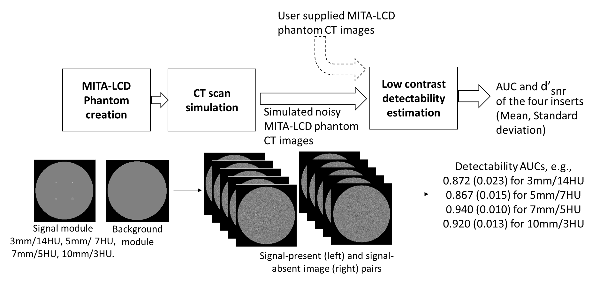

Low Contrast Detectability for CT Toolbox
=========================================

|zenodo| |docs|

**Low Contrast Detectability for CT (LCD-CT) Toolbox** provides a common interface to evaluate the low contrast detectability (LCD) performance of advanced nonlinear CT image reconstruction and denoising algorithms. The toolbox uses model observers (MO) to evaluate the LCD of targets with known locations in test images obtained with the `MITA-LCD phantom <https://www.phantomlab.com/catphan-mita>`_. The model observer detection accuracy is measured by the area under the receiver operating characteristic curve (AUC) and the detectability signal-to-noise ratio (d’_{snr}).  The LCD-CT toolbox can be used by CT developers to perform initial evaluation on image quality improvement or dose reduction potential of their reconstruction and denoising algorithms.

- **Regulatory Science Tool:** Check the FDA website for a description of the LCD-CT toolbox in the `Regulatory Science Tool Catalog <https://cdrh-rst.fda.gov/lcd-ct-low-contrast-detectability-lcd-test-assessing-advanced-nonlinear-ct-image-reconstruction-and>`_

.. |zenodo| image:: https://zenodo.org/badge/DOI/10.5281/zenodo.7996580.svg
    :alt: Zenodo Data Access
    :scale: 100%
    :target: https://doi.org/10.5281/zenodo.7996580

.. |docs| image:: https://readthedocs.org/projects/docs/badge/?version=latest
    :alt: Documentation Status
    :scale: 100%
    :target: https://lcd-ct.readthedocs.io/en/latest/?badge=latest

Features
--------

- Creating digital replica of the background and signal modules of the `MITA-LCD phantom <https://www.phantomlab.com/catphan-mita>`_.  
- Simuating sinogram and generate fan-beam CT scans of the digital phantoms based on the publicly available `Michigan Image Reconstruction Tolbox (MIRT) <https://github.com/JeffFessler/mirt>`_.
- Estimating low contrast detectability performance from the MITA-LCD phantom CT images using channelized Hoteling model observer with Laguerre-Gauss (LG) channels and two options of Difference-of-Gaussian (DOG) channels and Gabor channels.

Start Here
----------

.. _version requirements:

**Requirements**

- Matlab (**version > R2016a**) *or* Octave (**version > 4.4**)
- If the above Matlab or Octave requirements are not met, then `conda <https://conda.io/projects/conda/en/latest/user-guide/install/index.html>`_ is required to install Octave using the `installation`_ instructions.

If required versions of Matlab or Octave are not available on your system (see how to get `matlab version <https://www.mathworks.com/help/matlab/ref/version.html>`_ or `octave version <https://docs.octave.org/v4.4.0/System-Information.html#XREFversion>`_) then see `installation`_ for how to setup an Octave environment to run LCD-CT.

.. _installation:

**Installation**

1. Git clone the LCD-CT Toolbox repository:

.. code-block:: shell

    git clone https://github.com/DIDSR/LCD_CT
    cd LCD_CT

2. *If neither Matlab or Octave are installed or do not meet the `version requirements`_, you can source `install.sh` to prepare a `conda <https://conda.io/projects/conda/en/latest/user-guide/install/index.html>`_ environment. Note: this can take about 10 minutes to complete.

.. code-block:: shell

        source install.sh

*Expected run time: 10-30 min*

3. Test the installation

- From the bash command line `octave test.m` or `matlab -batch test.m`

- From the Matlab or Octave interactive prompt

.. code-block:: octave

        >> test

*Expected run time (Octave): 1 min 30 s*

Tool Reference
--------------

- RST Reference Number: RST24MD08.01
- Date of Publication: 09/24/2023
- Recommended Citation: U.S. Food and Drug Administration. (2023). LCD-CT: Low-contrast Detectability (LCD) Test for Assessing Advanced Nonlinear CT Image Reconstruction and Denoising Methods (RST24MD08.01). https://cdrh-rst.fda.gov/lcd-ct-low-contrast-detectability-lcd-test-assessing-advanced-nonlinear-ct-image-reconstruction-and

Disclaimer 
----------

**About the Catalog of Regulatory Science Tools**

The enclosed tool is part of the Catalog of Regulatory Science Tools, which provides a peer-reviewed resource for stakeholders to use where standards and qualified Medical Device Development Tools (MDDTs) do not yet exist. These tools do not replace FDA-recognized standards or MDDTs. This catalog collates a variety of regulatory science tools that the FDA's Center for Devices and Radiological Health's (CDRH) Office of Science and Engineering Labs (OSEL) developed. These tools use the most innovative science to support medical device development and patient access to safe and effective medical devices. If you are considering using a tool from this catalog in your marketing submissions, note that these tools have not been qualified as `Medical Device Development Tools <https://www.fda.gov/medical-devices/medical-device-development-tools-mddt>`_ and the FDA has not evaluated the suitability of these tools within any specific context of use. You may `request feedback or meetings for medical device submissions <https://www.fda.gov/regulatory-information/search-fda-guidance-documents/requests-feedback-and-meetings-medical-device-submissions-q-submission-program>`_ as part of the Q-Submission Program. 
For more information about the Catalog of Regulatory Science Tools, `OSEL_CDRH@fda.hhs.gov <mailto:OSEL_CDRH@fda.hhs.gov>`_. 
