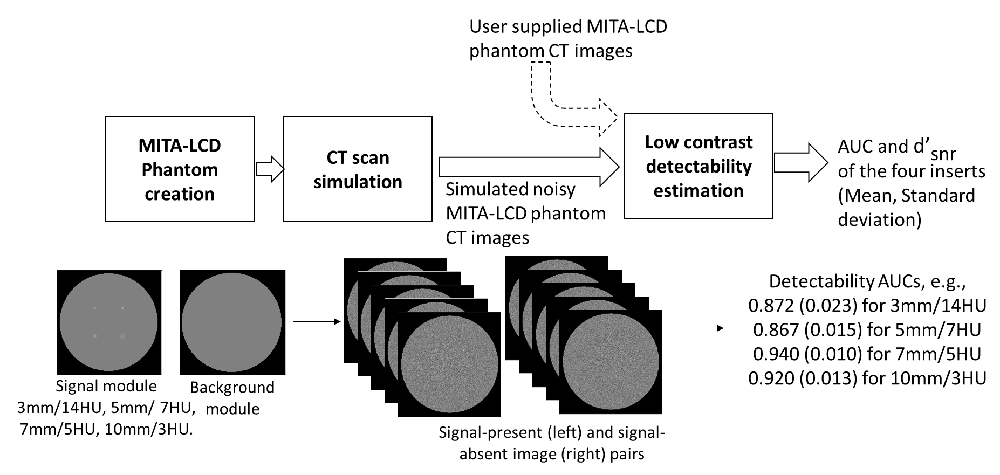

.. LCD for CT Toolbox documentation master file, created by
   sphinx-quickstart on Tue Apr 25 21:17:51 2023.
   You can adapt this file completely to your liking, but it should at least
   contain the root `toctree` directive.

Welcome to LCD for CT Toolbox's documentation!
==============================================

This documentation provides information regarding how to download, install, and use the LCD for CT Toolbox which is designed to low contrast detectactability in CT images.

Introduction
------------

**Low Contrast Detectability for CT (LCD-CT) Toolbox** provides a common interface to evaluate the low contrast detectability (LCD) performance of advanced nonlinear CT image reconstruction and denoising algorithms. The toolbox uses model observers (MO) to evaluate the LCD of targets with known locations in test images obtained with the `MITA-LCD phantom <https://www.phantomlab.com/catphan-mita>`_. The model oberver detection accuracy is measured by the area under the receiver operating characteristic curve (AUC) and the detectability signal-to-noise ratio (d’_{snr}).  The LCD-CT toolbox can be used by CT developers to perform initial evaluation on image quality impprovement or dose reduction potential of their reconstruction and denoising algorithms.

Installation
------------

.. _version requirements:

**Requirements**

- Matlab (**version > R2016a**) *or* Octave (**version > 4.4**)
- If the above Matlab or Octave requirements are not met, then `conda <https://conda.io/projects/conda/en/latest/user-guide/install/index.html>`_ is required to install Octave (See step 2 below).

If required versions of Matlab or Octave are not available on your system (see how to get `matlab version <https://www.mathworks.com/help/matlab/ref/version.html>`_ or `octave version <https://docs.octave.org/v4.4.0/System-Information.html#XREFversion>`_) then see `installation`_ for how to setup an Octave environment to run LCD-CT.

1. Git clone the LCD-CT Toolbox repository:

.. code-block:: shell

    git clone https://github.com/DIDSR/LCD_CT
    cd LCD_CT

2. *If neither Matlab or Octave are installed or do not meet the **version requirements**, you can source `install.sh` to prepare a `conda <https://conda.io/projects/conda/en/latest/user-guide/install/index.html>`_ environment. Or run the following lines in your command prompt:

.. code-block:: shell

   conda create --name octave -y && conda activate octave
   conda install -c conda-forge octave -y
   conda install -c conda-forge cxx-compiler -y
   octave --eval 'pkg install -forge image; pkg install https://github.com/apjanke/octave-tablicious/releases/download/v0.3.7/tablicious-0.3.7.tar.gz; pkg load image tablicious'

Note: this can take about 10-30 minutes to complete.

3. Test the installation

- From the bash command line:

.. tabs::

   .. tab:: Octave

      .. code-block:: shell

         $ octave test.m

   .. tab:: Matlab

      .. code-block:: shell

         $ matlab -batch test.m

- From the Matlab or Octave interactive prompt:

.. code-block:: octave

        >> test

Users
-----

Check out the :doc:`usage` section for further information.

Developers
----------

If you'd like to contribute to the code or documentation of this project, please check out our :doc:`contributing` page.

.. toctree::
   usage
   api
   contributing
   faq
   :maxdepth: 2
   :caption: Contents:

Indices and tables
==================

* :ref:`genindex`
* :ref:`search`
