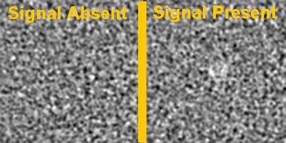

Usage
=====

Motivation
----------

Since the introduction of non-linear iterative CT reconstruction and image processing devices (FDA product code JAX) low contrast detectability has been an essential measure of image quality. This is because many of these non-linear image reconstruction and enhancement devices make assumptions about local-smoothness which determines where the algorithm denoises more aggresively. As smoothness is commonly measured mathematically as local gradients, this causes many of these noise reduction algorithms to perform better in high contrast regions but poorly in low contrast. However, low contrast lesions are the most difficult to detect by human readers as they are most easily obscured by noise. Furthermore such low contrast lesions are clinically significant so it is thus crucial to ensure that any image enhancement software applied to the image does not mistake low contrast lesions as noise and remove them. For these reasons low contrast detectability has been an invaluable component to medical image evaluations to ensure that the clinical utility of the image has not been impaired.

Measurement of low contrast detectability can be done in various ways. Human reader studies of detectability are the oldest method and often considered as a reference point to other measures of detectability. In human reader studies, human readers are given a series of images and report whether a signal is either present or absent (See Figure 1 for an example). However, given the difficulty of performing human reader studies when doing a parameter optimization of an image processing algorithm, model observers can be used to programatically assess the detectability of an object of interest in an image.

For this ease of use, model observers are routinely used by image processing device sponsors to support their device dose reduction or image quality claims. However, 

There are many types of model observers, some are designed to mimic human performance and act as surragates to human readers while others outperform human readers and can be used as a measure of the inherent information in an image. With

0. Images from a Directory
--------------------------

demo_00_images_from_directory.m

- demonstrates basics of loading signal-absent and signal-present image series in a 3D array to run a single model-observer study using provided small dataset
- This script also demonstrates how to load up multiple different types of Model Observer

1. Repeated Studies
-------------------------

demo_01_repeat_studies.m

- builds upon [demo_00](demo_00_images_from_directory.m) by demonstrating how to perform repeat studies to get a uncertainty estimates and export results to a csv file

2. Multiple Dose Levels
-----------------------

demo_02_multiple_dose_levels.m

- builds upon [demo_01](demo_01_repeat_studies.m) by demonstrating how to perform repeat studies at multiple dose levels to get detectability (e.g. auc or snr) as a function of dose level for multiple different observers

3. Accessing a large dataset
----------------------------

demo_03_access_large_dataset.m

- builds upon [demo_02](demo_02_multiple_dose_levels.m) by demonstrating how to perform repeat studies at multiple dose levels to get detectability (e.g. auc or snr) as a function of dose level for multiple different observers
- The large dataset used can be downloaded here:

.. image:: https://sandbox.zenodo.org/badge/DOI/10.5072/zenodo.1150650.svg
   :target: https://doi.org/10.5072/zenodo.1150650
